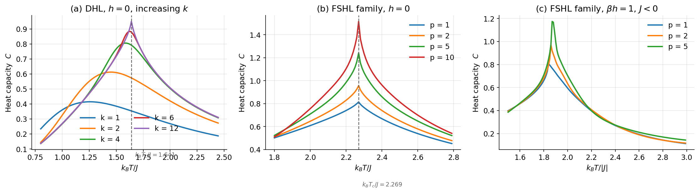

# Hierarchical Tensor Networks for Lattice Models

[](https://github.com/IakOBiaN/HTN/actions/workflows/ci.yml)
[](https://www.python.org/)
[](LICENSE)

Python implementation of the **Hierarchical Tensor Network (HTN)** approach for computing thermodynamic properties of statistical physics models on hierarchical lattices.

## Overview 

The HTN method computes the partition function of a lattice model by iteratively contracting a tensor network built on a hierarchical lattice geometry. Unlike regular-lattice methods (e.g., TRG), hierarchical lattices admit an exact renormalization group scheme: each contraction step replaces a cluster of tensors with a single effective tensor, and convergence of the free energy signals that the thermodynamic limit has been reached.

This repository provides an installable library (`htn/`) and four ready-to-run examples covering two models on two lattice geometries:

| Example script | Model | Lattice | Observable |
|---|---|---|---|
| `ising_diamond.py` | Ising | Diamond | Heat capacity vs. *T* |
| `ising_FSHL.py` | Ising | Folded square (FSHL) | Heat capacity vs. *T* |
| `binary_diamond.py` | Binary lattice gas | Diamond | Coverage, entropy, susceptibility, heat capacity vs. *μ* |
| `binary_FSHL.py` | Binary lattice gas | FSHL | Coverage, entropy, susceptibility, heat capacity vs. *μ* |

## Related publication

This repository accompanies:

> S. S. Akimenko and A. V. Myshlyavtsev, *"Tensor networks for hierarchical lattices"*, **EPL (Europhysics Letters)** 148, 61001 (2024).  
> DOI: [10.1209/0295-5075/ad994b](https://doi.org/10.1209/0295-5075/ad994b)

## Reproducing the paper

Figure 3 of the paper can be regenerated from scratch. Install the optional
plotting dependencies and run the reproduction script from the repository root:

```bash
pip install -e ".[plot]"
python -m reproduce.figure3_ising
```



**(a)** On the diamond hierarchical lattice the heat-capacity peak converges to the
exact critical temperature `k_B T_c / J = 1.641` as the renormalization depth `k`
grows. **(b)** Every member of the FSHL family peaks at the exact square-lattice
value `k_B T_c / J = 2 / ln(1 + sqrt(2)) = 2.269`. **(c)** An antiferromagnet in a
field (`beta h = 1`) on the FSHL family, whose critical point shifts with `p`.

The same calculation is available as a narrated, ready-to-run notebook,
[`notebooks/reproduce_paper.ipynb`](notebooks/reproduce_paper.ipynb). The raw
curves are written as CSV to `data/`. See [`reproduce/`](reproduce/) for details.

## Supported models

### Ising model

Spin-½ ferromagnet in an external field. The transfer matrix elements are determined by coupling constant *J* and external field *h*:

```
m_par = [h, J]
```

The heat capacity peak locates the critical temperature.

### Binary lattice gas

Two-component (A + B) lattice gas with chemical potentials *μ*_A, *μ*_B and pairwise interaction energies *ε*_AA, *ε*_BB, *ε*_AB:

```
m_par = [muA, muB, epsAA, epsBB, epsAB]
```

The `thermodynamics()` function can return coverage, entropy, susceptibility, heat capacity, and grand potential — caller chooses which.

## Supported lattice geometries

### Diamond hierarchical lattice

A fractal lattice built by replacing each bond with a diamond motif. The coordination number is set via `calc.coord` (default 3 for a diamond graph).

### Folded Square Hierarchical Lattice (FSHL)

A family of hierarchical lattices parameterised by an integer *p* (`calc.metParam`). At *p* = 1 the geometry resembles a folded square; larger *p* increases the effective coordination number and cluster size.

## Installation

**Requirements:** Python ≥ 3.9, NumPy.

```bash
git clone https://github.com/IakOBiaN/HTN.git
cd HTN
python -m venv .venv
```

Activate the virtual environment:

| Shell | Command |
|---|---|
| Linux / macOS | `source .venv/bin/activate` |
| Windows `cmd.exe` | `.venv\Scripts\activate.bat` |
| Windows PowerShell | `.venv\Scripts\Activate.ps1` |

Then install the package (editable, so edits take effect without reinstalling).
Optional extras pull in plotting and development tools:

```bash
pip install -e .              # core (NumPy only)
pip install -e ".[plot]"      # + Matplotlib, for the reproduction scripts
pip install -e ".[dev]"       # + pytest / ruff / mypy, for development
```

> **PowerShell users:** if `Activate.ps1` fails with
> *"running scripts is disabled on this system"*, run this once (per user, persistent):
>
> ```powershell
> Set-ExecutionPolicy -ExecutionPolicy RemoteSigned -Scope CurrentUser
> ```
>
> Alternatively, skip activation entirely and call the venv's Python directly:
>
> ```powershell
> .venv\Scripts\python.exe -m pip install -e .
> .venv\Scripts\python.exe ising_diamond.py
> ```

## Quick start

### Ising model on a diamond lattice — heat capacity scan

```python
import numpy as np

import htn

calc = htn.CalcConfig()
calc.model   = "ising"
calc.lattice = "diamond"
calc.coord   = 3
calc.constant = 1.0   # dimensionless units

J, h = 1.0, 0.0
for T in np.arange(1.8, 2.6, 0.05):
    result = htn.thermodynamics(calc, T, m_par=[h, -J], heat_capacity=True)
    print(f"T = {T:.2f}   Cv = {result['heat_capacity']:.6f}")
```

### Binary lattice gas on FSHL — equation of state

```python
import numpy as np

import htn

calc = htn.CalcConfig()
calc.model    = "binary"
calc.lattice  = "FSHL"
calc.metParam = 1        # p parameter

T = 100.0
print("mu   coverage   entropy   susceptibility   heat_capacity   grand_potential")
for mu in np.arange(-10.0, 40.0, 2.0):
    m_par = [mu, 10.0, 4.0, 6.0, 0.0]
    obs = htn.thermodynamics(
        calc, T, m_par,
        coverage=True, susceptibility=True, entropy=True, heat_capacity=True,
    )
    print(f"{mu:6.1f}  {obs['coverage']:.4f}  {obs['entropy']:.4f}  "
          f"{obs['susceptibility']:.4f}  {obs['heat_capacity']:.4f}  "
          f"{obs['grand_potential']:.4f}")
```

Run the bundled example scripts directly from the repository root:

```bash
python ising_diamond.py
python binary_FSHL.py
```

Output is printed to stdout as whitespace-separated columns, ready for piping into plotting tools.

## Running tests

A small regression suite (`tests/test_regression.py`) checks selected
thermodynamic observables against values captured from the original
published code on the four bundled examples.

With the virtual environment from the [Installation](#installation)
section active, install the development dependencies and run pytest:

```bash
pip install -e ".[dev]"
pytest -v
```

The suite runs 32 parametrised cases in about 15 s on a modern laptop.

Without activating the venv (handy on Windows PowerShell):

```powershell
.venv\Scripts\python.exe -m pip install -e ".[dev]"
.venv\Scripts\python.exe -m pytest -v
```

To regenerate the baseline values (for example after an intentional
physics-level change):

```bash
python tools/capture_baseline.py
```

Paste the printed dictionaries into `tests/test_regression.py`.

## API reference

### `CalcConfig`

Central configuration object. Key attributes:

| Attribute | Default | Description |
|---|---|---|
| `model` | `"ising"` | Physical model: `"ising"`, `"binary"`, or `"mono"` |
| `lattice` | `"square"` | Lattice geometry: `"diamond"` or `"FSHL"` |
| `metParam` | `10` | Method / lattice parameter (FSHL: *p* value) |
| `coord` | `4` | Coordination number |
| `constant` | `0.008314` | Gas constant *R* (kJ mol⁻¹ K⁻¹); set to `1` for dimensionless units |
| `iterations` | `300` | Maximum HTN iterations |
| `methodTolerance` | `1e-8` | Convergence threshold on free energy per node |

### `simulate(calc, T, m_par)`

Returns `ln Z / N` (grand potential per node in units of `constant * T`) at temperature *T* and model parameters `m_par`.

### `thermodynamics(calc, T, m_par, *, coverage=False, susceptibility=False, entropy=False, heat_capacity=False, mu_index=0, dmu=1e-3, dT=1e-3)`

Compute the requested thermodynamic observables as finite-difference
derivatives of the grand potential.  Each observable is selected by a
keyword flag and only the minimal set of points is evaluated:

| Observable | Derivative | Sample points |
|---|---|---|
| `coverage` | 1st w.r.t. *μ* | *μ*−, *μ*+ |
| `susceptibility` | 2nd w.r.t. *μ* | *μ*−, center, *μ*+ |
| `entropy` | 1st w.r.t. *T* | *T*−, *T*+ |
| `heat_capacity` | 2nd w.r.t. *T* | *T*−, center, *T*+ |

The center point is shared between the two second derivatives.  When
any second derivative is requested the center is evaluated anyway, so
the dict also contains `grand_potential` (= `simulate(calc, T, m_par)`).

Returns a `dict` with only the requested keys.  Example:

```python
htn.thermodynamics(calc, T, m_par, heat_capacity=True)
# {'grand_potential': ..., 'heat_capacity': ...}
```

## Project structure

```
htn/
├── htn/                     # the installable package
│   ├── __init__.py          # public API: CalcConfig, simulate, thermodynamics
│   ├── BuildTensors.py      # transfer matrix construction for each model
│   ├── TensorNetworks.py    # HTN contraction step (diamond and FSHL)
│   └── MainScripts.py       # CalcConfig, simulate(), thermodynamics()
├── reproduce/               # scripts that regenerate the paper figures
│   ├── _common.py           # shared computation / plotting helpers
│   └── figure3_ising.py     # Fig. 3: Ising on DHL and the FSHL family
├── notebooks/
│   └── reproduce_paper.ipynb # narrated walk-through of Fig. 3
├── figures/                 # generated figures (PNG)
├── data/                    # generated curves (CSV)
├── tests/
│   └── test_regression.py   # baseline values captured from the published code
├── tools/
│   └── capture_baseline.py  # regenerate baseline values
├── ising_diamond.py         # example: Ising / diamond lattice
├── ising_FSHL.py            # example: Ising / FSHL
├── binary_diamond.py        # example: binary gas / diamond lattice
├── binary_FSHL.py           # example: binary gas / FSHL
├── pyproject.toml           # package metadata + pytest configuration
├── requirements.txt         # runtime dependencies
├── requirements-dev.txt     # adds pytest on top of requirements.txt
├── requirements-plot.txt    # adds matplotlib for the reproduction scripts
├── CITATION.cff             # how to cite the software and the paper
└── LICENSE
```

## License

Released under the **MIT License** — free for any use, including commercial and
closed-source projects, provided the copyright notice is retained. See
[LICENSE](LICENSE) for the full text.

If you use HTN in academic work a citation is appreciated (see
[CITATION.cff](CITATION.cff) or the [Related publication](#related-publication)
section above), but this is a courtesy, not a license requirement.
